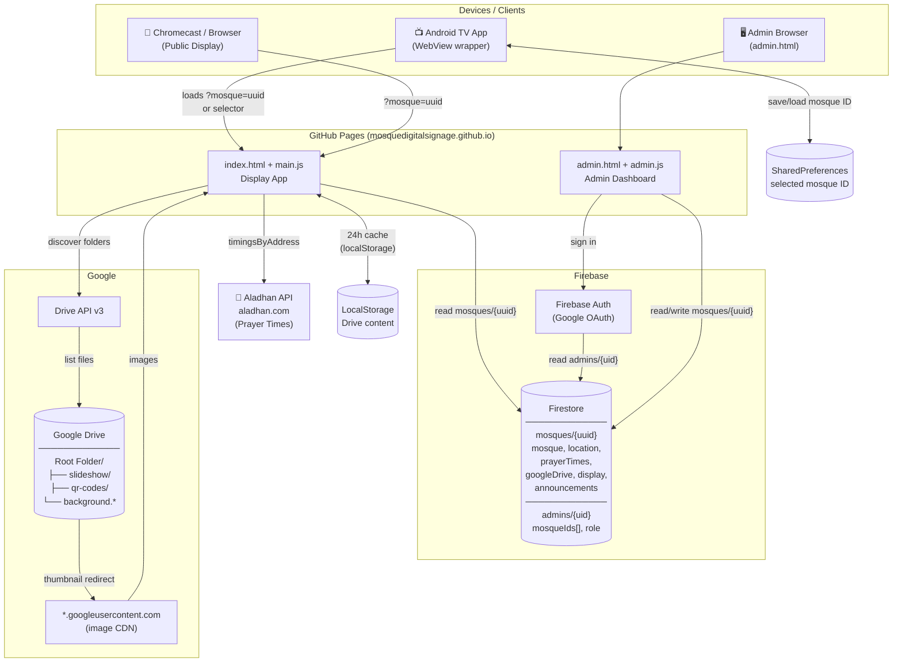

# System Architecture



## Data Flow Summary

### Display (Public, No Auth)
1. URL `?mosque={uuid}` → fetch `mosques/{uuid}` from Firestore
2. Firestore config → discover Google Drive folder structure via Drive API v3
3. Drive thumbnails → redirect to `*.googleusercontent.com` → rendered as slideshow / QR codes / background
4. Zipcode + country → Aladhan API → prayer times
5. Drive content cached in LocalStorage for 24h; refreshed after each full slideshow rotation

### Admin Dashboard (Auth Required)
1. Google OAuth via Firebase Auth
2. Auth UID → `admins/{uid}` → resolves linked `mosqueIds[]`
3. Admin reads/writes `mosques/{uuid}` in Firestore
4. Changes reflect on the display immediately (no deploy needed)

### Android TV App
1. First launch: loads selector screen, user signs in and picks a mosque
2. Mosque UUID saved to SharedPreferences → auto-loaded on future launches
3. Long-press BACK (3s): clears saved mosque, shows selector again
4. MENU/SETTINGS key: opens server URL config dialog (for self-hosting)
5. Sign-in uses `signInWithRedirect` (WebView has no popup support)

## Firestore Data Model

```
mosques/{uuid}
├── mosque:       { name, shortName, headerText, pageTitle }
├── location:     { zipcode, country, timezone }
├── prayerTimes:  { calculationMethod, jummahTime, fallbackTimes }
├── googleDrive:  { rootFolderId }
├── display:      { slideshowIntervalMs, ayatRotationIntervalMs, theme{}, announcementColor }
├── announcements: [{ text, enabled }]
└── customAyats:  [{ en }]

admins/{uid}
├── mosqueIds:  string[]   (array of mosque UUIDs)
├── email:      string
└── role:       "mosque_admin" | "platform_admin"
```

## Security

| Layer | Mechanism |
|-------|-----------|
| Firestore read | Public (`allow read: if true`) — UUID is the access token |
| Firestore write | Auth required + `mosqueId in adminRecord.mosqueIds` |
| Superuser | `role: "platform_admin"` in `admins/{uid}` (Firestore-controlled) |
| XSS | All user-sourced strings use `textContent` / `escapeHtml()` |
| CSP | `Content-Security-Policy` meta tag on both HTML pages |
| Android network | `network_security_config.xml` — HTTPS only, localhost exception |
| WebView | `MIXED_CONTENT_NEVER_ALLOW` |
